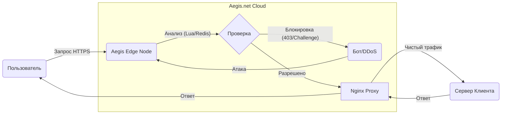

# Aegis.net Integration Architecture

Как мы внедряем защиту на сайты клиентов? Основная модель — **Reverse Proxy** (как у Cloudflare).

Мы **не трогаем код сайта клиента**. Нам не нужно устанавливать плагины в WordPress или менять их backend. Мы встаем *перед* их сервером как щит.

## 1. Схема работы (The Flow)



## 2. Процесс подключения (Onboarding)

Чтобы подключить сайт (например, `example.com`):

1.  **Добавление в Dashboard**: Клиент вводит домен `example.com` в нашей админке.
2.  **Указание Origin**: Клиент указывает реальный IP своего сервера (например, `123.45.67.89`).
3.  **DNS Switch**: Это главный шаг. Клиент меняет DNS записи своего домена:
    *   Было: `example.com` -> `123.45.67.89` (Напрямую)
    *   Стало: `example.com` -> `185.x.x.x` (Наш Anycast IP)

## 3. Что происходит технически?

*   **Входящий трафик**: Весь мир стучится на наши IP.
*   **Фильтрация**: Наш Nginx + `aegis.lua` проверяют каждый запрос (Rate Limit, Bot, WAF).
*   **Проксирование**: Если запрос чистый, мы делаем `proxy_pass` на Origin IP клиента.

## 4. Local Development (Как тестируем мы)

Так как у нас нет реального DNS, мы эмулируем это локально:

*   **Aegis Node**: Запускаем OpenResty на порту `8000`.
*   **Mock Site (Origin)**: Запускаем тестовый сайт (FastAPI/Node/etc) на порту `9000`.
*   **Конфиг Nginx**:
    ```nginx
    location / {
        access_by_lua_file "aegis.lua";
        proxy_pass http://127.0.0.1:9000; # Наш "Origin"
    }
    ```

Таким образом, "клиентские" сайты могут быть написаны на чем угодно (PHP, Python, Go), мы защищаем их снаружи.
